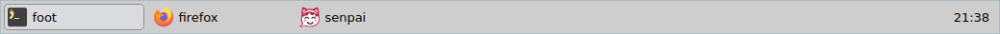

<h3 align="center"><br />t2play </h3>
<p align="center">A Wayland panel inspired by tint2</p>

# Why

Pursuing beauty and bringing the tint2 spirit to the modern desktop

# Obligatory Screenshot



# Dependencies

- meson, ninja
- wayland-server
- [libsfdo]

[libsfdo]: https://gitlab.freedesktop.org/vyivel/libsfdo

# Build

```
meson setup build
meson compile -C build
```

# What

Status: In early development.

# References

- https://gitlab.com/o9000/tint2/-/blob/master/doc/tint2.md
- https://github.com/o9000/tint2/blob/master/doc/tint2.md
- https://code.google.com/archive/p/tint2/
- https://code.google.com/archive/p/tint2/wikis/Configure.wiki
- https://github.com/addy-dclxvi/tint2-theme-collections

